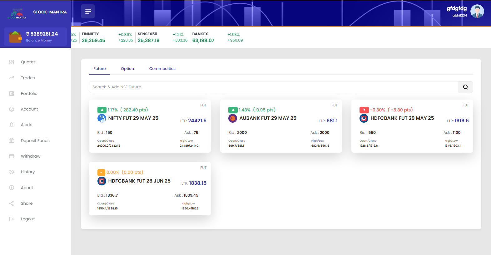
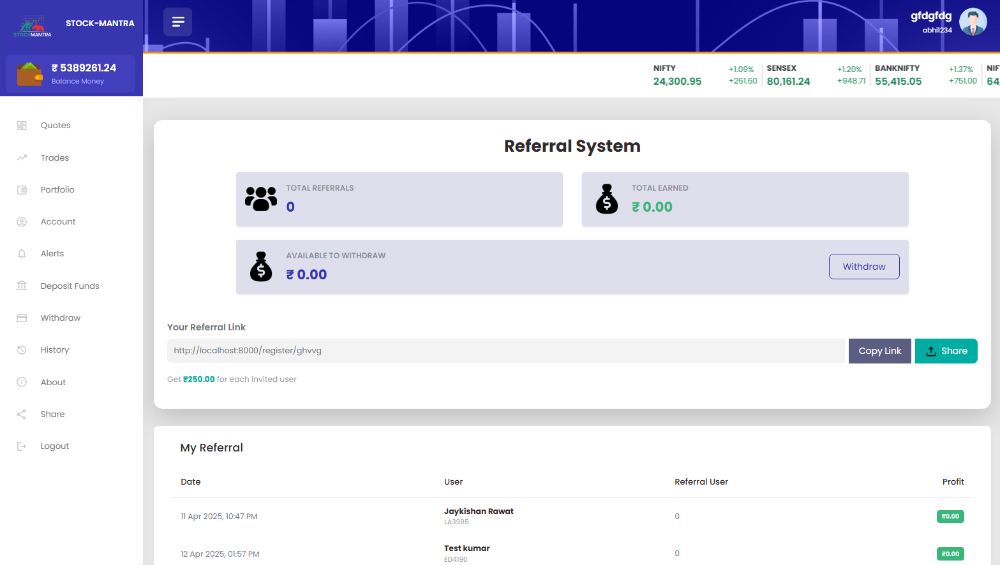
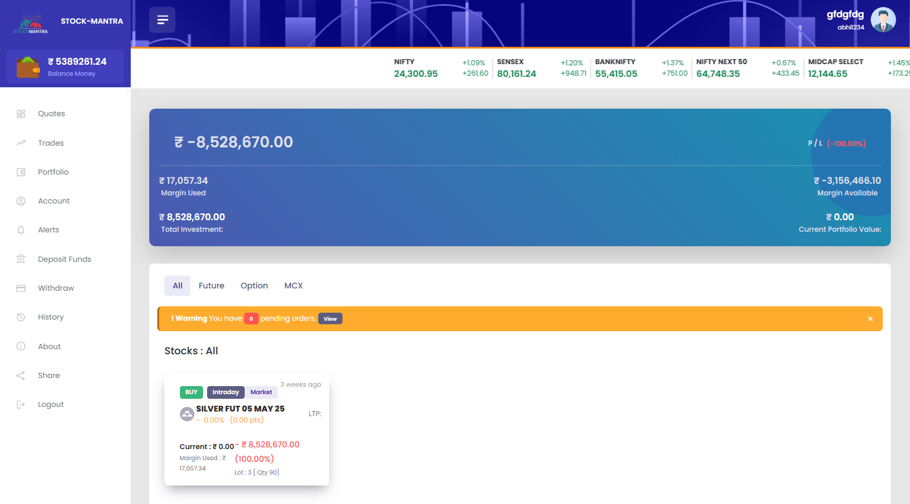
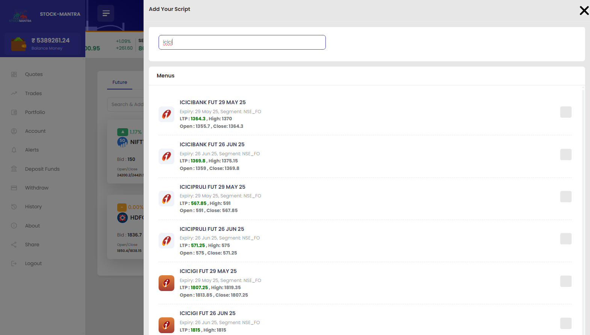
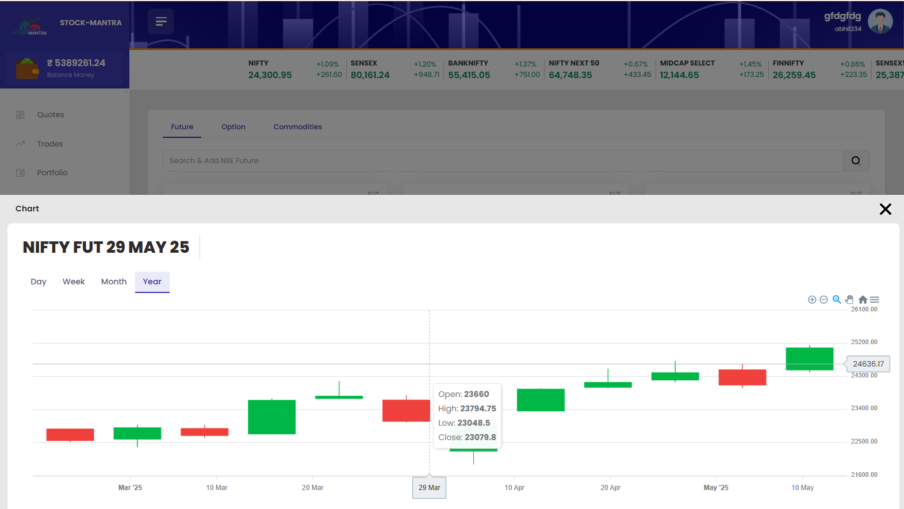
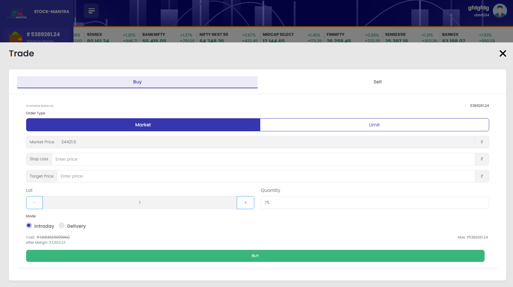
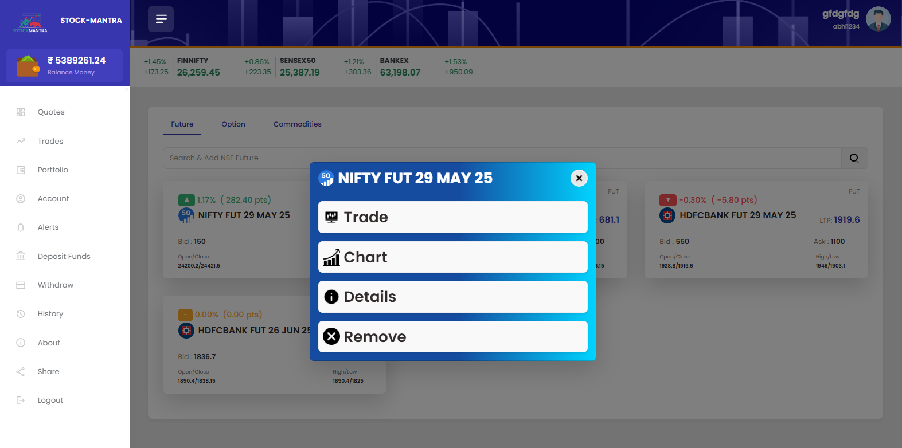

# 📊 Stock Market Exchange Demo (Built with Laravel)

A Laravel-based web application simulating real-time stock trading and portfolio tracking.

## 🚀 Features

- 📈 Live Stock Charts – Visualize real-time stock trends and performance using Upstock WebSocket API.

- 💹 Portfolio Tracker – Monitor virtual investments and evaluate outcomes.

- 🧪 Market Simulation – Practice trading without financial risk.

- 🔗 External links for GitHub, video demo, and screenshot viewer.

- 🖼️ Modal screenshot gallery with scrollable interface.

- ⚙️ Queue System – Laravel jobs and Redis queue for handling real-time tasks.

- 🐳 Dockerized Setup – Application runs in isolated Docker containers.

- 📡 WebSocket Integration – Real-time data updates via PHP WebSockets.

- ☁️ Ubuntu Supervisor – Used for queue worker and background job management.

- 🧩 Optimized API Calls – Uses array chunks to group and batch API requests efficiently.

## 🖼️ Screenshot










## 🔗 Live Demo

[View Demo](https://stockx.getsource.codes)

## 📁 Installation

```bash
git clone https://github.com/maverickxjames/stock-new.git
cd stock-new
composer install
cp .env.example .env
php artisan key:generate
